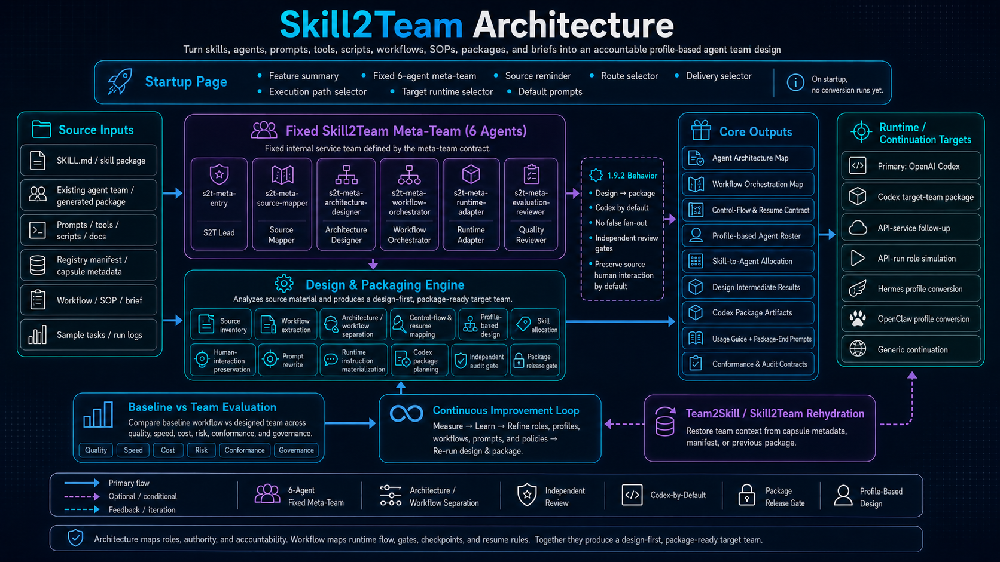
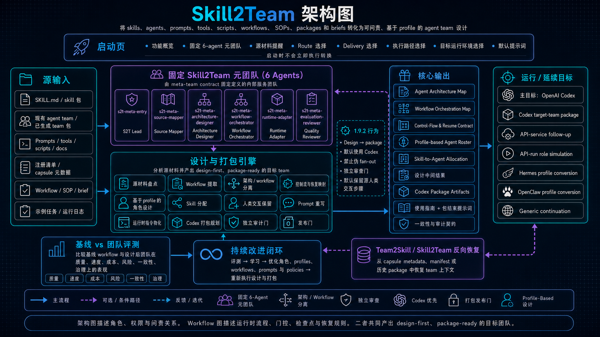

# Skill2Team ([中文](#skill2team-中文说明))

**Skill2Team** is provided as [skill2team-1.9.2.zip](skill2team-1.9.2.zip). It is designed for the point where a skill has become too complex to maintain as one large instruction set, especially when design work, audit work, review gates, execution flow, and deployment assumptions are mixed together. Skill2Team converts that kind of complex skill into a multi-agent team design, so each agent has a clearer responsibility, boundary, handoff, and quality gate. Its output is organized in two steps: first, it generates a runtime-neutral `design` that can be used for further runtime-specific design and deployment; second, using OpenAI Codex as the example runtime, it can further generate a `package` that contains the target team information, agent profiles, manifests, usage guidance, conformance checks, and registration/start/use prompts. This project will continue to add features and improve over time.

**Skill2Team Architecture Diagram (English)**



## Main Outputs

Skill2Team has two main output levels:

| Output | Meaning |
|---|---|
| `design` | First generate a runtime-neutral team design. This design explains the target roles, responsibility boundaries, agent architecture, workflow orchestration, human-interaction handling, review gates, and migration decisions. It can then be used as a basis for further runtime-specific design and deployment. |
| `package` | Using OpenAI Codex as the example runtime, further turn the design into a target-team package that includes team information, agent profiles, Codex-oriented agent artifacts, manifests, usage guidance, conformance checks, and registration/start/use prompts. |

## Main Features

- Convert a `SKILL.md`, skill folder, skill zip, generated team package, SOP, workflow note, prompt bundle, or brief into a profile-based agent team design.
- Separate design responsibilities from audit, review, runtime orchestration, and deployment-facing instructions.
- Produce a clear Agent Architecture Map that identifies role ownership, responsibilities, boundaries, tools, handoffs, and review gates.
- Produce a separate Workflow Orchestration Map that describes runtime order, branching, checkpoints, human waits, resume behavior, and terminal conditions.
- Preserve source-required human interaction, approvals, startup behavior, artifacts, and checkpoints unless the user explicitly chooses automation or redesign.
- Support three routes: `source-to-team`, `brief-to-team`, and `guided-to-team`.
- Support `design` output for team planning and `package` output for Codex-oriented target-team packaging.

## Design Ideas and Method

Skill2Team treats agents as accountable roles, not as a one-to-one translation of every prompt, tool, script, or workflow step. A skill may remain a reusable capability, a script may remain a helper, and a workflow step may remain a runtime node instead of becoming an agent. The key idea is to make hidden structure explicit: who designs, who executes, who reviews, who preserves source constraints, and who adapts the design to the target runtime.

The main design method separates three layers:

| Layer | Purpose |
|---|---|
| Agent Architecture Map | Defines who owns each responsibility, tool boundary, context boundary, handoff, and review gate. |
| Workflow Orchestration Map | Defines what happens at runtime, including sequence, branch, loop, gate, fan-out/fan-in, checkpoint, human wait, and terminal state. |
| Control-Flow & Resume Contract | Defines how artifacts, reruns, invalidation, recovery, and resume behavior stay traceable and safe. |

For nontrivial conversions, Skill2Team generally prefers a small top-level team, often around 5-6 agents, unless the source is simple enough for fewer roles or complex enough to require more isolation.

## Environment and Limits

- Skill2Team is designed for OpenAI Codex-centered workflows.
- Direct model API execution is not the default path. If used, it should be treated as an explicit API-service follow-up or role simulation, not as Codex custom-agent execution.
- Generated package files do not automatically prove that a target team is runnable. Registration, reload behavior, handoff readiness, and smoke tests still matter.
- Skill2Team does not install generated packages into the current project by default.
- It does not convert every source element into an agent. The design keeps reusable skills, helper scripts, prompts, local resources, and workflow nodes separate when that is cleaner.
- Human-interaction steps are preserved by default when they are part of the source workflow.

## How to Use

Start the skill:

```text
start the skill inside skill2team-1.9.2.zip
```

Design a team from source material:

```text
start the skill inside skill2team-1.9.2.zip
Route: source-to-team
Delivery: design
Execution path: direct-skill
Target runtime: codex
Source material: <SOURCE_SKILL_ZIP / SOURCE_FOLDER / SKILL.md / GENERATED_TEAM_PACKAGE / WORKFLOW_NOTES>
Preserve source human-interaction steps by default.
Separate Agent Architecture Map from Workflow Orchestration Map.
```

Design a team from a brief:

```text
start the skill inside skill2team-1.9.2.zip
Route: brief-to-team
Delivery: design
Execution path: direct-skill
Target runtime: codex
Source material: <PASTED_BRIEF_OR_SOP>
```

Use guided intake when the source or target is unclear:

```text
start the skill inside skill2team-1.9.2.zip
Route: guided-to-team
Delivery: design
Execution path: direct-skill
Target runtime: codex
I will provide source material after the initial questions.
```

Generate a Codex target-team package:

```text
start the skill inside skill2team-1.9.2.zip
Route: source-to-team
Delivery: package
Execution path: direct-skill
Target runtime: codex
Source material: <SOURCE_SKILL_ZIP / SOURCE_FOLDER / GENERATED_TEAM_PACKAGE / REGISTRY_MANIFEST>
Generate a Codex target-team package with profiles, manifests, usage guide, conformance checks, and package-end registration/start/use prompts.
```

Generate a Codex target-team package with the meta-team-first path:

```text
start the skill inside skill2team-1.9.2.zip
Route: source-to-team
Delivery: package
Execution path: meta-team-first
Target runtime:: codex
Source material: paper-framework-figure-studio-pro-v3.2.15c-skill.zip
Human-interaction mode: preserve source human-interaction steps by default.
There should be an independent agent responsible for reviewing the quality of the image-generation prompt.
```

After converting a source skill into a target-team package, you can start the generated package with this prompt:

```text
Run pfos-entry-human-gatekeeper to generate a diagram for semiDFL.pdf.
Generated target-team package: F:\skill2team\paper_framework_figure_target_team_package.
Entry role: pfos-entry-human-gatekeeper.
Spawn real independent subagents for the generated specialist profiles and record target_run_fanout_status=real_session_target_subagents.
Do not describe this as registered target-team execution, and do not collapse specialist work into the entry agent.Do not review or inspect any existing diagrams inside semiDFL.pdf.
Here, "do not review" does not mean you are forbidden from independently designing a similar structure.
Rather, it means you should not be influenced by or biased toward the existing diagram. Instead, decide whether to generate a similar structure purely based on the actual content of the paper.
```

## License

This project is released under the **MIT No Attribution License (MIT-0)**. See `LICENSE` for details.

---

# Skill2Team 中文说明

**Skill2Team** 以 [skill2team-1.9.2.zip](skill2team-1.9.2.zip) 提供。它面向一种常见问题：skill 越来越复杂，设计、审计、质量审核、运行流程和部署假设混在同一套长指令里，导致维护、迁移和复用都变困难。Skill2Team 的目标是把这种复杂 skill 转换成由 multi-agent 构成的 team，让每个 agent 的职责、边界、交接关系和质量门更加清楚。它的产出分为两步：第一步生成与具体运行环境相对解耦的 `design`，之后可以基于这个 design 按目标运行环境继续设计和部署；第二步以 OpenAI Codex 运行环境为例，在 design 基础上进一步生成包含 team 信息的 `package`，包括 agent profiles、manifests、使用说明、一致性检查，以及注册/启动/使用提示词。这个项目会不断补充功能，持续改进。

**Skill2Team Architecture Diagram (Chinese)**



## 主要产出

Skill2Team 有两个主要产出层级：

| 产出 | 含义 |
|---|---|
| `design` | 第一步先生成与具体运行环境相对解耦的团队设计。这个 design 会说明目标角色、职责边界、agent 架构、workflow 编排、人工交互保留方式、审核门和迁移决策。之后可以基于这个 design，继续按具体运行环境进行进一步设计和部署。 |
| `package` | 以 OpenAI Codex 运行环境为例，在 design 基础上进一步生成包含 team 信息的目标团队 package，包括 agent profiles、Codex 方向的 agent 文件、manifests、使用说明、一致性检查，以及注册/启动/使用提示词。 |

## 主要功能

- 将 `SKILL.md`、技能目录、技能压缩包、已生成团队包、SOP、工作流说明、提示词包或简短需求转换为基于 profile 的智能体团队设计。
- 将设计职责、审计职责、质量审核、运行编排和部署说明拆开，避免全部混在一个大 skill 里。
- 生成 Agent Architecture Map，用于说明角色职责、边界、工具、交接关系和审核门。
- 生成独立的 Workflow Orchestration Map，用于说明运行顺序、分支、检查点、人工等待、恢复策略和终止条件。
- 默认保留来源中要求的人工交互、审批、启动行为、产物和检查点，除非用户明确选择自动化或重设计。
- 支持三种路线：`source-to-team`、`brief-to-team`、`guided-to-team`。
- 支持 `design` 产出用于团队规划，也支持 `package` 产出用于面向 Codex 的目标团队打包。

## 设计思想和方法

Skill2Team 把 agent 视为可问责的角色，而不是把每个 prompt、tool、script 或 workflow step 都机械地翻译成 agent。一个 skill 可以继续作为可复用能力，一个 script 可以继续作为辅助脚本，一个 workflow step 也可以继续作为运行时节点。核心思想是把隐藏在复杂 skill 里的结构显式化：谁负责设计，谁负责执行，谁负责审核，谁负责保留来源约束，谁负责把设计适配到目标运行环境。

核心方法是分离三层设计：

| 层级 | 作用 |
|---|---|
| Agent Architecture Map | 明确谁负责什么、工具边界、上下文边界、交接关系和审核门。 |
| Workflow Orchestration Map | 明确运行时发生什么，包括顺序、分支、循环、门控、并行/汇合、检查点、人工等待和终止状态。 |
| Control-Flow & Resume Contract | 明确产物、重跑、失效、恢复和断点续跑如何保持可追踪、可控制。 |

对于非简单转换，Skill2Team 通常倾向于较小的顶层团队，常见范围是 5-6 个 agent；如果来源非常简单，可以更少；如果需要强隔离、多重独立审核或复杂并行角色，也可以更多。

## 使用环境和限制

- Skill2Team 面向以 OpenAI Codex 为中心的工作流。
- 直接模型 API 调用不是默认路径。如需使用，应明确标记为 API-service follow-up 或 role simulation，不能描述为 Codex custom-agent 执行。
- 生成 package 文件不等于目标团队已经可运行。仍需关注注册、重新加载、交接可用性和 smoke tests。
- Skill2Team 默认不会把生成的 package 安装到当前项目中。
- 它不会把所有来源元素都转换为 agent；在更清晰的情况下，会保留 skill、helper script、prompt、本地资源和 workflow node 的独立身份。
- 来源中的人工交互步骤默认保留。

## 如何使用

启动 skill：

```text
start the skill inside skill2team-1.9.2.zip
```

从来源材料生成团队设计：

```text
start the skill inside skill2team-1.9.2.zip
Route: source-to-team
Delivery: design
Execution path: direct-skill
Target runtime: codex
Source material: <SOURCE_SKILL_ZIP / SOURCE_FOLDER / SKILL.md / GENERATED_TEAM_PACKAGE / WORKFLOW_NOTES>
Preserve source human-interaction steps by default.
Separate Agent Architecture Map from Workflow Orchestration Map.
```

从简短需求生成团队设计：

```text
start the skill inside skill2team-1.9.2.zip
Route: brief-to-team
Delivery: design
Execution path: direct-skill
Target runtime: codex
Source material: <PASTED_BRIEF_OR_SOP>
```

当来源或目标不清楚时，使用 guided intake：

```text
start the skill inside skill2team-1.9.2.zip
Route: guided-to-team
Delivery: design
Execution path: direct-skill
Target runtime: codex
I will provide source material after the initial questions.
```

生成 Codex 目标团队包：

```text
start the skill inside skill2team-1.9.2.zip
Route: source-to-team
Delivery: package
Execution path: direct-skill
Target runtime: codex
Source material: <SOURCE_SKILL_ZIP / SOURCE_FOLDER / GENERATED_TEAM_PACKAGE / REGISTRY_MANIFEST>
Generate a Codex target-team package with profiles, manifests, usage guide, conformance checks, and package-end registration/start/use prompts.
```

使用 meta-team-first 路径生成 Codex 目标团队包：

```text
start the skill inside skill2team-1.9.2.zip
Route: source-to-team
Delivery: package
Execution path: meta-team-first
Target runtime:: codex
Source material: paper-framework-figure-studio-pro-v3.2.15c-skill.zip
Human-interaction mode: preserve source human-interaction steps by default.
There should be an independent agent responsible for reviewing the quality of the image-generation prompt.
```

当对源 skill 转换为目标 team 的 package 后，可以使用如下提示词进行启动：

```text
Run pfos-entry-human-gatekeeper to generate a diagram for semiDFL.pdf.
Generated target-team package: F:\skill2team\paper_framework_figure_target_team_package.
Entry role: pfos-entry-human-gatekeeper.
Spawn real independent subagents for the generated specialist profiles and record target_run_fanout_status=real_session_target_subagents.
Do not describe this as registered target-team execution, and do not collapse specialist work into the entry agent.Do not review or inspect any existing diagrams inside semiDFL.pdf.
Here, "do not review" does not mean you are forbidden from independently designing a similar structure.
Rather, it means you should not be influenced by or biased toward the existing diagram. Instead, decide whether to generate a similar structure purely based on the actual content of the paper.
```

## 许可证

本项目使用 **MIT No Attribution License (MIT-0)**。详情见 `LICENSE`。
